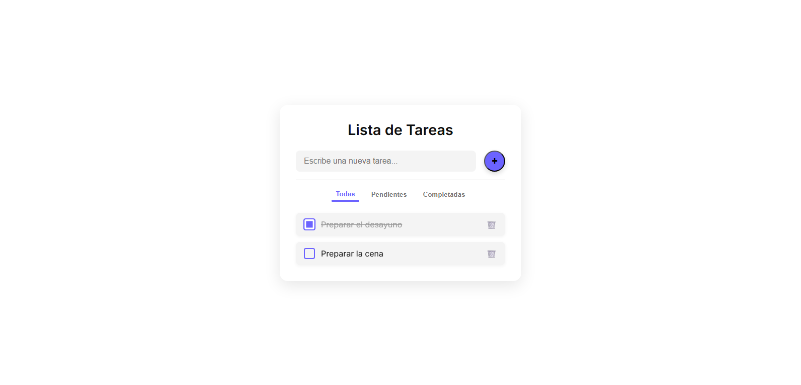

# 📝 Lista de Tareas con Almacenamiento Local

Este proyecto es una práctica de desarrollo web enfocada en el uso de **`localStorage`** para lograr la persistencia de datos en el navegador. Permite agregar, eliminar y marcar tareas como completadas, con una interfaz moderna construida 100% con **HTML, CSS y JavaScript puro**, sin frameworks ni librerías como Tailwind o Bootstrap.

---

## 🎯 Objetivo del proyecto

Desarrollar una aplicación funcional y visualmente atractiva que permita al usuario:

- Gestionar su lista de tareas.
- Conservar las tareas aún después de cerrar o recargar la página gracias al almacenamiento local.
- Interactuar con una interfaz responsive, minimalista y fluida.

---

## 🛠️ Tecnologías utilizadas

- **HTML5** – estructura semántica de la app.
- **CSS3** – diseño moderno y responsivo, con efectos visuales y animaciones suaves.
- **JavaScript (Vanilla)** – lógica completa, manipulación del DOM y persistencia con `localStorage`.

---

## 🦖 Funcionalidades

- ✅ Agregar tareas con Enter o botón.
- ✅ Marcar tareas como completadas.
- ✅ Eliminar tareas individuales con animación suave.
- ✅ Filtrar por estado: Todas, Pendientes, Completadas.
- ✅ Animaciones sutiles al aparecer y desaparecer tareas.
- ✅ Almacenamiento persistente con `localStorage`.

---

## 🖼️ Vista previa

  

---

## 📁 Estructura del proyecto

```
todo-app/
├── index.html # Estructura base
├── styles.css # Estilos y animaciones modernas
└── script.js # Logica de tareas y almacenamiento local
```

---

## ❓ Cómo usar

1. Clona este repositorio:
   ```bash
   git clone https://github.com/RAgredaIpar/todo-list-app

2. Abre index.html en tu navegador.

---

## 📌 Nota

Este proyecto fue realizado como una práctica personal para afianzar conceptos fundamentales de desarrollo web sin depender de librerías externas. Todas las funcionalidades, interacciones y estilos fueron implementados desde cero.

---

## 📃 Licencia

Este proyecto está disponible bajo la licencia MIT.